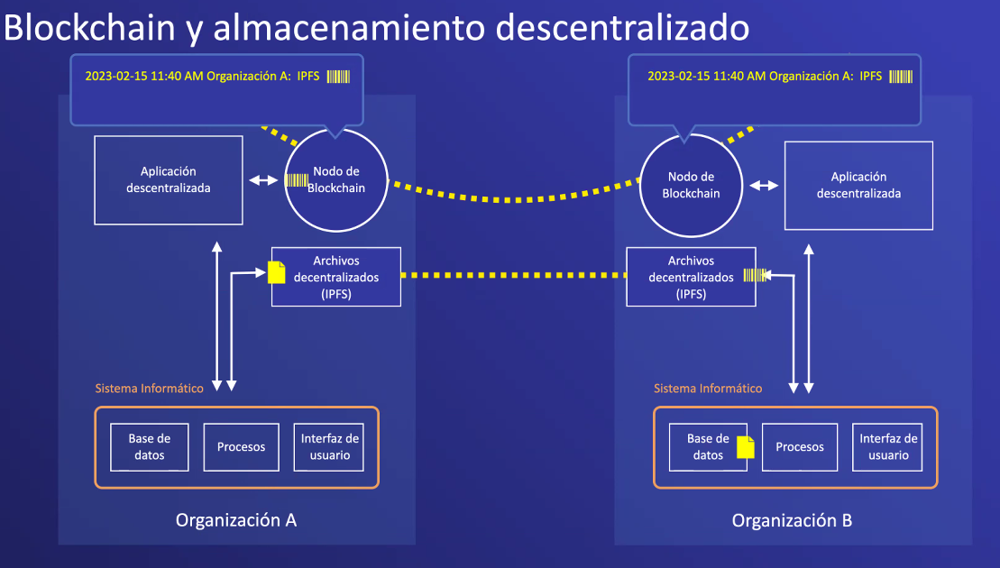
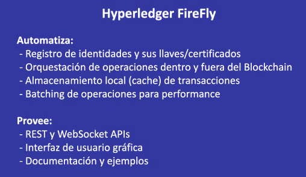
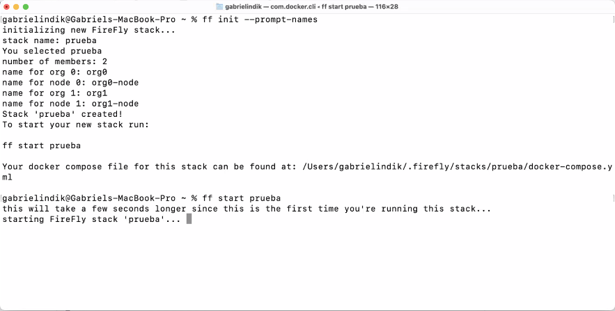

)

- **FireFly**:  una única API para cominicar envios entre usuarios 
  - un mecanismo muy eficiente para recibir una transacción para que una transferencia sea completa
  - Internamente tiene una base de datos de a forma de cache entonces puedes ver las consultas historias **almacenamiento local**
  - Si deseas enviar miles de transacciones de datos, uno normalmente esta limitado por el numero de transacciones por los nodos, entonces el batching agrupa las transacciones pueden haber desenas de mensaje y se calcula el hash y el grupo de hash se puede ejecutar una gran cantidad de operaciones vana ser grupadas y el grupo solo cuenta como una transacción. 
  - se puede utilizar postman 
  - uno con una interfaz gráfica para ver las transacciones enviadas y los miembor presentes en la red
  - 

- [Documentación técnica ](https://hyperledger.github.io/firefly/)
   

- [Repositoro de herramienta de línea de comando para firefly](https://github.com/hyperledger/firefly-cli)

inicio rápido de furefly 

esto creara contenedores de docker para manejar los componentes 

